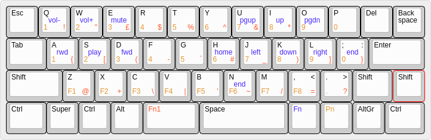

Programming the Vortex Core
===========================

Create a layout file
--------------------

* Use: [TsFreddie/much-programming-core] ([Github:
  TsFreddie/much-programming-core]) to create a `layout.cys` file.
* Start by uploading the `export.txt` JSON layout file.
* Make modifications.
* Export JSON for prosperity.
* Generate the binary `layout.cys` file.

Program the board
-----------------

* Unplug the board.
* Hold `Fn + d` and then re-plug in the board.
* Copy the `layout.cys` file to the newly discovered USB Mass Storage device.
* _Copy the `export.txt` to the board, to make it easy to reconfigure in the
  absence of this repo being checked out._
* Eject, unplug and re-plug in the board.

OS Gotcha's
-----------

* Manjaro: Default keymap for `[Shift+]AltGr+#` does not give backslash (`\`)
  or bar/pipe (`|`). Added a new `xkbmap` that can is loaded to correct this.

Layouts Visualised
------------------

Experimenting with layouts and visualising them in an external tool:

* [Keyboard-layout-editor.com] ([Github: ijprest/keyboard-layout-editor])
  (NOTE: not connected my Github account to save layouts to my account, since
  the site is HTTP only).

### L3 (`Fn + Shift`)

Wanted a layout for programming, to reduce the finger gymnastics of hitting the
symbols keys during programming in emacs. Main highlights:

* Using Layer 3 as my programming layout.
* Most used symbols and brackets symmetric on the home row of Fn1.
* Numbers on home row and top row of Pn.
* Shifted numbers right by 1 so that 1 is under the left pinkie instead of
  being on `tab`.
* Top row of symbols on Fn1 is the normal `Shift + <number>` symbols.
* Function keys on bottom row of Pn.
* Aimed for all symbols (shifted and non-shifted), except `<>;:,.`, to be on
  Fn1 and symmetrical for the hands.
* Most used symbols in reach of index, middle fingers.

Reference:

* Keyboard-layout-editor.com: Vortex Core L3 (permalink) (NOTE: Ugly link since
  it breaks markdown when attempting to do a reference link): http://www.keyboard-layout-editor.com/##@@=Esc&_t=%23000000%0A%23c27600%0A%0A%23ff2e00%0A%0A%0A%0A%0A%0A%23110fff%3B&=Q%0A1%0A%0A!%0A%0A%0A%0A%0A%0Avol-&=W%0A2%0A%0A"%0A%0A%0A%0A%0A%0Avol+&=E%0A3%0A%0A£%0A%0A%0A%0A%0A%0Amute&_t=%23000000%0A%23c27600%0A%0A%23ff2e00%3B&=R%0A4%0A%0A$&=T%0A5%0A%0A%25&=Y%0A6%0A%0A%5E&_t=%23000000%0A%23c27600%0A%0A%23ff2e00%0A%0A%0A%0A%0A%0A%23110fff%3B&=U%0A7%0A%0A%2F&%0A%0A%0A%0A%0A%0Apgup&=I%0A8%0A%0A*%0A%0A%0A%0A%0A%0Aup&=O%0A9%0A%0A(%0A%0A%0A%0A%0A%0Apgdn&_t=%23000000%0A%23c27600%0A%0A%23ff2e00%3B&=P%0A0%0A%0A)&_t=%23000000%3B&=Del&=Back%0A%0A%0A%0A%0A%0Aspace%3B&@_w:1.25%3B&=Tab&_t=%23000000%0A%23c27600%0A%0A%23ff2e00%0A%0A%0A%0A%0A%0A%23110fff%3B&=A%0A1%0A%0A%7B%0A%0A%0A%0A%0A%0Arwd&=S%0A2%0A%0A%5B%0A%0A%0A%0A%0A%0Aplay&=D%0A3%0A%0A(%0A%0A%0A%0A%0A%0Afwd&_t=%23000000%0A%23c27600%0A%0A%23ff2e00%3B&=F%0A4%0A%0A-&=G%0A5%0A%0A%60&_t=%23000000%0A%23c27600%0A%0A%23ff2e00%0A%0A%0A%0A%0A%0A%23110fff%3B&=H%0A6%0A%0A%23%0A%0A%0A%0A%0A%0Ahome&=J%0A7%0A%0A%2F_%0A%0A%0A%0A%0A%0Aleft&=K%0A8%0A%0A)%0A%0A%0A%0A%0A%0Adown&=L%0A9%0A%0A%5D%0A%0A%0A%0A%0A%0Aright&=%2F%3B%0A0%0A%2F:%0A%7D%0A%0A%0A%0A%0A%0Aend&_t=%23000000&w:1.75%3B&=Enter%3B&@_w:1.75%3B&=Shift&_t=%23000000%0A%23c27600%0A%0A%23ff2e00%3B&=Z%0AF1%0A%0A%2F@&=X%0AF2%0A%0A+&=C%0AF3%0A%0A%5C&=V%0AF4%0A%0A%7C&=B%0AF5%0A%0A'&_t=%23000000%0A%23c27600%0A%0A%23ff2e00%0A%0A%0A%0A%0A%0A%23110fff%3B&=N%0AF6%0A%0A~%0A%0A%0A%0A%0A%0Aend&_t=%23000000%0A%23c27600%0A%0A%23ff2e00%3B&=M%0AF7%0A%0A%2F%2F&=,%0AF8%0A<%0A%2F=&=.%0AF9%0A>%0A%23&_t=%23000000&w:1.25%3B&=Shift&_t=%23ff2e00%3B&=Fn1%3B&@_t=%23000000&w:1.25%3B&=Ctrl&=Super&=Alt&_t=%23c27600%3B&=Pn&_t=%23ff2e00&w:1.75%3B&=Fn1&_t=%23000000&w:2.75%3B&=Space&_t=%23110fff%3B&=Fn&_t=%23000000%3B&=AltGr&=Menu&_w:1.25%3B&=Ctrl
* [Keyboard-layout-editor.com: Vortex Core L3 (json)].

[TsFreddie/much-programming-core]: https://tsfreddie.github.io/much-programming-core/
[Github: TsFreddie/much-programming-core]: https://github.com/TsFreddie/much-programming-core

[Github: ijprest/keyboard-layout-editor]: https://github.com/ijprest/keyboard-layout-editor
[Keyboard-layout-editor.com]: http://www.keyboard-layout-editor.com/#/
[Keyboard-layout-editor.com: Vortex Core L3 (json)]: l3/keyboard-layout.json
